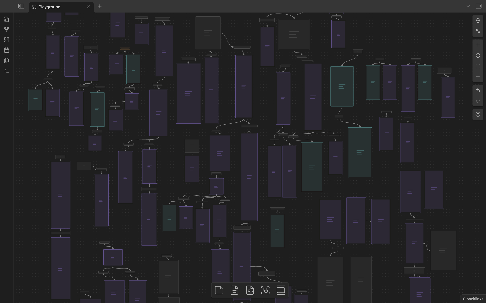

<h1 align="center">AI Chat Tree</h1>

> **Note:** This plugin is in early development and is not yet ready for general use. (Soon)

An Obsidian plugin for engaging with GPT/SearchAI through canvas notes. Ancestor notes and files are included in the chat context. Create branching GPT/SearchAI conversations.

Essentially, this plugin allows you to chat in a tree structure, retaining the context of previous discussions as you branch out. It's perfect for exploring ideas and thoughts in a hierarchical manner.
